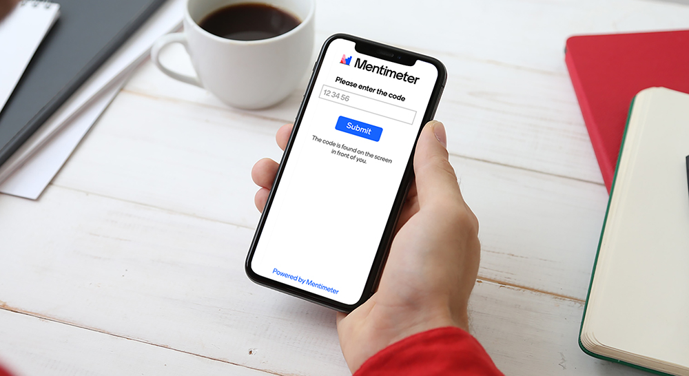

[Updated 2025-April-29 03:17 PM]

# 📚 [Fabulous Fasters](https://dcblack.github.io/FabulousFasters/index.html) Book Review

####  Join us each Friday morning for our Fabulous Fasters Book Review.

When: ==Every Friday 10 AM Eastern / 9 AM Central / 8 AM Mountain / 7 AM Pacific==

Where: ==**Zoom Review CLICK HERE** ➜== https://us02web.zoom.us/j/85220846334?pwd=n1SgD7MBfYIlI1YaavhWPN59MbdfVi.1

What: Review topic list below, and make ready to vote on one or tell about something missed.

#### Future Topics

   - [x] Blind Spots, Marty Makary MD
   - [ ] Brain Energy, Christopher Palmer MD
   - [ ] Dark Calories, Catherine Shanahan MD
   - [ ] Drop Acid, David Perlmutter MD
   - [x] [Good Energy, Casy Means MD](https://www.caseymeans.com/) [Completed 1/25/2025]
   - [ ] Iodine Why You Need It, David Brownstein MD [^!]
   - [ ] Keto Continuum, Annette Bosworth MD [^!]
   - [ ] Lies I Taught in Medical School, Robert Lufkin MD
   - [ ] Nature Wants Us To Be Fat, Richard Johnson MD
   - [ ] Why We Get Sick, Ben Bickman PhD
   - [ ] Why We Sleep, Matthew Walker PhD [^!]
   - [ ] Others? (let us know)

Click image below to visit the poll to determine our next book: 

[^!]: High interest

#### Meeting format

1. As you join, please say hello, tell us how you are doing, and share your current top goal.
2. We will discuss the book or video casually. Please read or view it, but don't let the lack thereof keep you from attending. We will summarize and review its aspects.

## Past Topics

   Dates                |  #  | Topic | Comments 
:--------:              | :-: | ------------------------------------------------------------------------------------------------------------------------------------------------------------------------------- | ------------------------------------------------------------------------------------------------------------------------------------------------------------------------------------------------------------------- 
10/26/2024              |     | Tucker Carlson interview with Calley & Casey Means MD titled How Big Pharma Keeps Us Sick https://tuckercarlson.com/tucker-show-casey-calley-means | Good conversation on various topics. Also pointed to other interviews (Dr. Boz and Joe Rogan) 
11/01/2024 - 01/25/2025 |     | Good Energy, Intro & Chapter 1 thru Chapter 9. Download resources [HERE](https://www.caseymeans.com/goodenergy#materials). | Focused discussions. Many factors affecting us. Go thru the checklists. Try the recipes. 
02/08/2025              |     | Why We Sleep |

#### Join Zoom Meeting

==**CLICK HERE** ➜== https://us02web.zoom.us/j/85220846334?pwd=n1SgD7MBfYIlI1YaavhWPN59MbdfVi.1

Meeting ID: 852 2084 6334
Passcode: 226784

---

One tap mobile
+13462487799,,85220846334#,,,,*226784# US (Houston)
+12532158782,,85220846334#,,,,*226784# US (Tacoma)

---

Dial by your location
• +1 346 248 7799 US (Houston)
• +1 253 215 8782 US (Tacoma)
• +1 669 444 9171 US
• +1 669 900 9128 US (San Jose)
• +1 719 359 4580 US
• +1 253 205 0468 US
• +1 312 626 6799 US (Chicago)
• +1 360 209 5623 US
• +1 386 347 5053 US
• +1 507 473 4847 US
• +1 564 217 2000 US
• +1 646 558 8656 US (New York)
• +1 646 931 3860 US
• +1 689 278 1000 US
• +1 301 715 8592 US (Washington DC)
• +1 305 224 1968 US
• +1 309 205 3325 US

Meeting ID: 852 2084 6334
Passcode: 226784

Find your local number: https://us02web.zoom.us/u/kb0aXzKJBe

