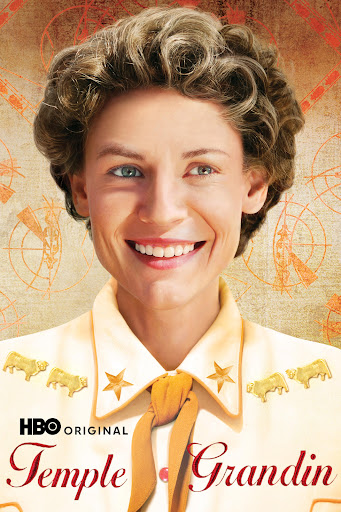

# Temple Grandin Movie

The film "Temple Grandin" is a biographical drama that premiered on HBO on February 6, 2010 It stars Claire Danes as Temple Grandin, an autistic woman who became a leading scientist in humane livestock handling The movie covers significant parts of Grandin's life, including her early years and her rise to prominence in the field of animal care.

Directed by Mick Jackson, the film received critical acclaim for its portrayal of Grandin's unique perspective on the world and her contributions to the livestock industry Claire Danes's performance as Temple Grandin was particularly praised, with many critics noting her ability to convey the complexities of Grandin's character without resorting to sentimentality

The movie has also been recognized with several awards, including multiple Primetime Emmy Awards for Outstanding Made for Television Movie, Outstanding Lead Actress in a Miniseries or a Movie (Claire Danes), and Outstanding Supporting Actor in a Miniseries or a Movie (David Strathairn)

As of today, the film can be streamed on Max It is also available for purchase or rental on platforms such as Apple TV, Microsoft Store, Amazon Video, and Fandango At Home

The film has received mixed reactions from the autistic community, with some viewers appreciating its representation of autism and Grandin's life, while others have expressed concerns about its portrayal of autism and Grandin's views on certain aspects of the autism spectrum

* Movie short: https://www.youtube.com/shorts/97grE8zIg0A 
* 3 types of kids https://youtube.com/shorts/g9IL6ke_RHA?si=QPxlBgELtYMQLXiq
* Ted Talk https://youtu.be/UKhg68QJlo0?si=RNKUyk2Gb8cGkZpU
* Temple Grandin**: A biographical drama film about the life of Temple Grandin, an autistic woman who became a leading scientist in humane livestock handling

* Just Watch https://www.justwatch.com/us/movie/temple-grandin 
* Amazon https://www.amazon.com/gp/video/detail/B003ZUTVJS/ref=atv_dp_share_cu_r (Rent \$3.79)

